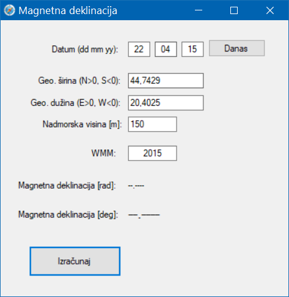
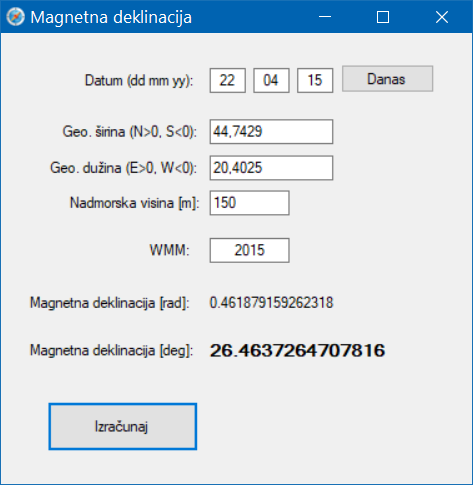
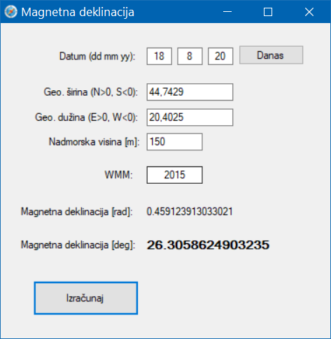
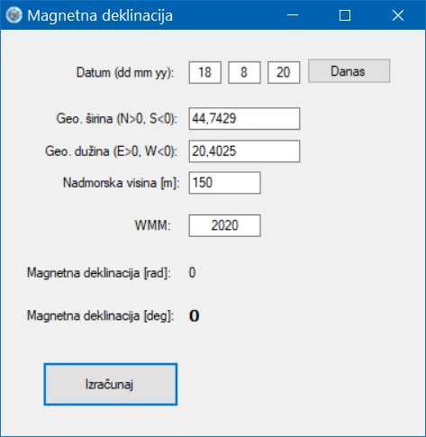

# World Magnetic Model (WMM) Point Calculation in C# (Windows.Forms GUI)
 World Magnetic Model (WMM) Point Calculation - Magnetic Declination Estimation (outdated, uses 2014/2015 data)  
 
### Keywords:  

> WMM,	World Magnetic Model  
> Magnetic Declination Estimation  
> Windows.Forms GUI (C# .NET)  

  
  
  
  
  

### References  
<a href="https://bluetoque.ca/2013/01/magnetic-declination-in-c-sharp/">Magnetic Declination in C#</a>  
<a href="http://www.oplopanax.ca/Downloads/MagVar.cs">MagVar.cs - Module to calculate magnetic variation and field given position, altitude, and date</a>  
<a href="https://en.wikipedia.org/wiki/Magnetic_declination">wiki - Magnetic declination</a>
